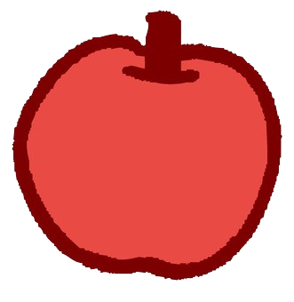

<html>

<body>

<h2 style="text-align:center;"><strong>✧˖°  Welcome to Nora Ahadian's blog!!  °˖✧</strong></h2>
 

 Would you like a fruit? 

  

    
  

  

    
  

  

    
  

  

    
  

</body>

</html>