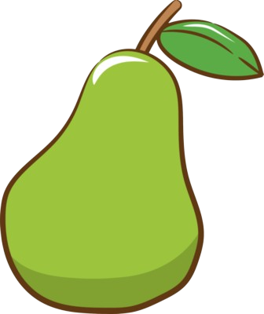

<head>
  
  

</head>

<body>

<h2 style="text-align:center;">✧˖°  Welcome to Nora Ahadian's blog!!  °˖✧</h2>
 

<strong>
 Would you like a fruit? 
</strong>

  

  

    <a href="https://youtu.be/ZWjR3d0WGBE">
      
      
Yummy Apple

    </a>
  

  

    <a href="https://youtu.be/kaIpvamevnc">
      
      
Delicious Grapes

    </a>
  

  

    <a href="https://youtu.be/GFaLrFe4w9g">
      
      
Wow an orange

    </a>
  

  

    <a href="https://youtu.be/-OmGLzgTa-4">
      
      
Cherry!

    </a>
  

  

    <a href="https://youtu.be/V1VFy7S7GEU">
      
      
Juicy pear

    </a>
  

 
 
 
<h2 style="text-align:center;"> Thanks for visiting my page </h2>

 

</body>